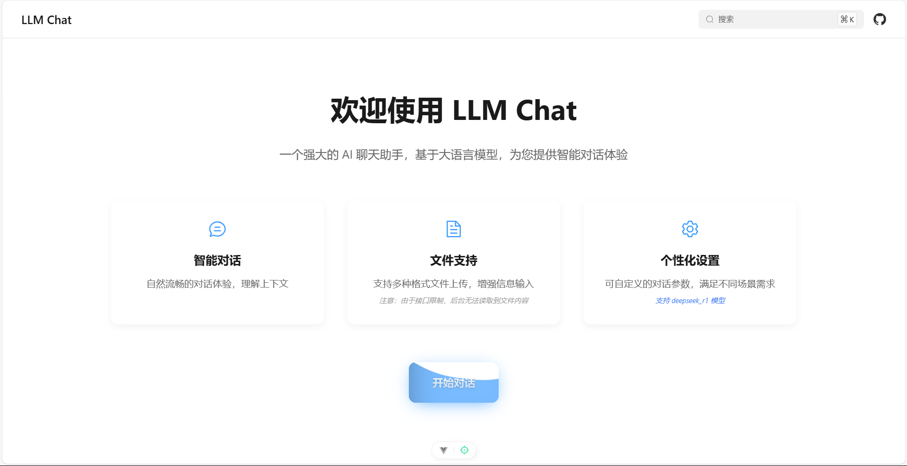
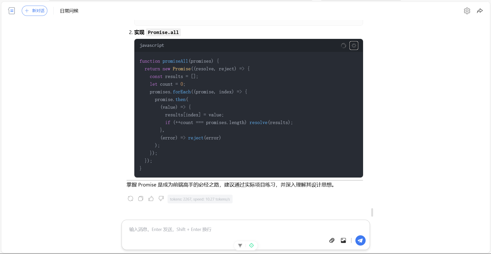
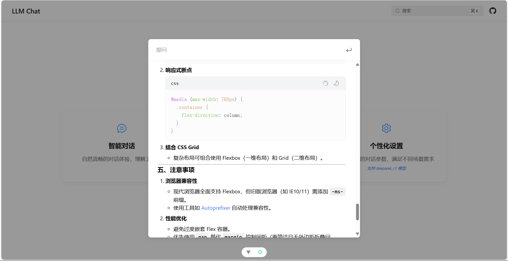

# AI Chat Application

一个基于 Vue 3 的现代化 AI 聊天应用，支持流式响应、Markdown 渲染、代码高亮以及文件上传预览等功能。


## 🌟 特性

- 💬 多会话管理
- 📝 Markdown 支持
- 🖥️ 代码高亮显示
- 📤 文件和图片上传
- 🌊 流式响应
- 🎨 深色/浅色主题
- 💾 本地数据持久化
- 📱 响应式设计

## 🛠️ 技术栈

- **前端框架**: Vue 3 + Vite
- **状态管理**: Pinia
- **UI 组件**: Element Plus
- **样式处理**: SCSS
- **Markdown 渲染**: Marked.js
- **代码高亮**: Highlight.js
- **动画效果**: Animate.css
- **持久化存储**: Pinia-plugin-persistedstate

## 📸 项目演示

### 首页展示


_首页包含项目介绍和主要功能入口，简洁直观的设计风格。_

### 独立对话界面


_支持多会话管理、消息历史、代码高亮等功能，提供流畅的对话体验。_

### 内联搜索对话


_快捷的内联搜索对话框，支持快速检索和问答，提升使用效率。_

## 📦 项目结构

```bash
src/
├── assets/ # 静态资源
├── components/ # 组件
│ ├── ChatInput.vue # 聊天输入框组件
│ ├── ChatMessage.vue # 消息显示组件
│ ├── DialogEdit.vue # 对话编辑弹窗
│ ├── PopupMenu.vue # 侧边菜单组件
│ ├── SearchDialog.vue # 搜索对话框组件
│ └── SettingsPanel.vue # 设置面板组件
├── stores/ # Pinia 状态管理
│ ├── chat.js # 聊天相关状态
│ └── setting.js # 设置相关状态
├── utils/ # 工具函数
│ ├── api.js # API 请求封装
│ ├── markdown.js # Markdown 处理
│ └── messageHandler.js # 消息处理
├── views/ # 页面
│ ├── HomePage.vue # 首页
│ └── ChatView.vue # 主聊天页面
└── App.vue # 根组件
```

## 🚀 功能特点

### 多会话管理

- 创建、切换、编辑和删除会话
- 会话标题自动保存
- 确保至少存在一个会话

### 消息功能

- 支持文本消息发送
- 图片和文件上传预览
- 流式响应显示
- Markdown 实时渲染
- 代码块语法高亮
- 代码复制功能

### 用户界面

- 响应式设计适配多种设备
- 简洁现代的界面风格
- 流畅的动画过渡效果
- 深色/浅色主题切换

### 设置选项

- 模型选择
- 流式响应开关
- API Key 配置
- 最大 Token 限制

## 🔧 配置项

### 模型设置

- 支持多种 LLM 模型
- 可配置 API 密钥
- 自定义模型参数

### 界面设置

- 主题切换
- 字体大小调整
- 界面布局设置

## 💾 数据持久化

使用 Pinia 持久化插件实现：

- 会话历史记录
- 用户设置
- 主题偏好

## 🔨 开发指南

### 安装依赖

```bash
pnpm install
```

### 运行项目

```bash
pnpm dev
```

## 📝 使用说明

1. 配置 API Key
2. 选择合适的模型
3. 开始新对话或从历史记录中选择
4. 可以发送文本消息、上传图片或文件
5. 使用 Markdown 语法获得更好的排版效果

## 🤝 贡献指南

欢迎提交 Issue 和 Pull Request 来帮助改进项目。

## 📄 许可证

[MIT License](LICENSE)
